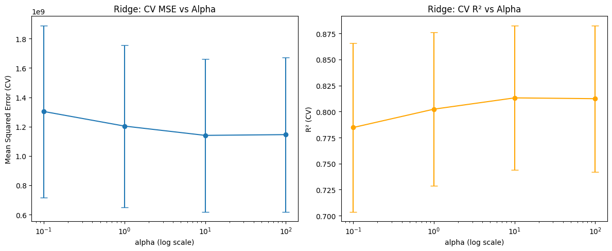

# SC5002-GROUP13
This repository contains the group project for SC5002

[dataset link](https://www.kaggle.com/competitions/house-prices-advanced-regression-techniques/data)

### Dataset and Validation Strategy  

This project uses the **House Prices – Advanced Regression Techniques** dataset from Kaggle.  

- **train.csv (1460 × 81)** contains both features and the target variable `SalePrice`.  
- **test.csv (1459 × 80)** contains only features (no `SalePrice`), and is designed for Kaggle submission.  

Since `test.csv` has no labels, it cannot be used for model evaluation. To properly assess performance and compare **Linear Regression** with **Ridge Regression**, we split the provided `train.csv` into **training** and **validation** subsets (e.g., 80/20).  

This ensures:  
- Reliable calculation of evaluation metrics (**RMSE, R²**).  
- Fair comparison between models.  
- Prevention of overfitting by checking model generalization.  

After evaluation, the best-performing model can be retrained on the **full training dataset** and applied to the Kaggle `test.csv` for prediction.  

These results show that Ridge Regression with an appropriate regularization strength achieves more stable performance and better generalization compared to plain Linear Regression.

<p align="center">
  
</p>

## How to Run

```bash
# create environment
conda create -n sc python=3.10

# activate environment
conda activate sc

# install dependencies
pip install -r requirements.txt

# run notebook (open in VS Code or Jupyter)
jupyter notebook Lab2_HousePrice_Prediction.ipynb
